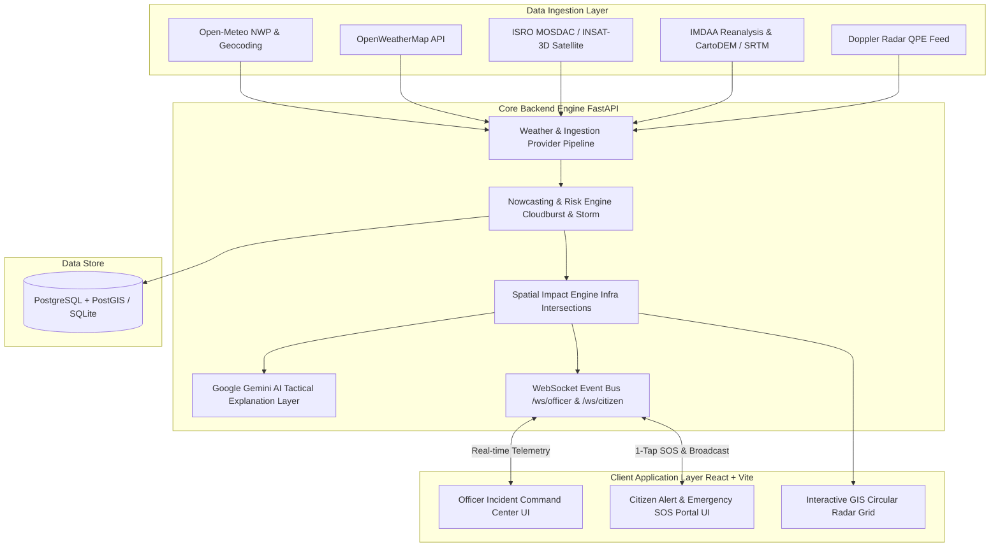

# 🛡️ SkyShield AI (VarshDristhi) — AI-Powered Cloudburst & Flash Flood Early Warning System

[](https://sih.gov.in)
[](https://fastapi.tiangolo.com/)
[](https://reactjs.org/)
[](https://postgis.net/)
[](LICENSE)

> **Smart India Hackathon Problem Statement 26077 — Ministry of Earth Sciences (MoES)**  
> *AI-Driven Hyper-Local Early Warning System for Severe Weather Nowcasting, Cloudburst Detection, and Tactical Disaster Response*

---

## 📌 Executive Summary

**SkyShield AI** is an advanced meteorological nowcasting and disaster response platform designed to mitigate cloudbursts, severe thunderstorms, and urban flash flooding. By fusing multi-source meteorological observations, high-resolution Digital Elevation Models (DEM), Doppler Weather Radar Quantitative Precipitation Estimation (QPE), and ISRO MOSDAC / NCMRWF IMDAA datasets, SkyShield AI delivers high-precision lead-time warnings and automated tactical emergency dispatch recommendations.

---

## 🏗️ System Architecture & Workflow

SkyShield AI combines a high-reliability React Single Page Application (SPA) with a Python FastAPI backend and a spatial GIS scientific risk engine.



---

## ✨ Key Features

- **🌐 Dual UI Command Interfaces**:
  - **Officer Command Center**: Comprehensive situational awareness with incident management, emergency responder dispatch, active risk zone monitoring, and alert bulletin broadcasts.
  - **Citizen Emergency Portal**: Hyper-local warnings, 1-tap SOS emergency dispatch with real-time location telemetry, and nearest relief shelter navigation.
- **🛰️ Multi-Source Meteorological Fusion**:
  - Real-time NWP observations, stability index calculations (CAPE, CIN, IWV, CTT, wind shear), and Doppler Radar QPE grid overlays.
  - Ingestion adapters for ISRO MOSDAC (INSAT-3D/3DR) and NCMRWF IMDAA datasets.
- **⛰️ Topographic Risk Mapping & Flood Routing**:
  - Spatial risk analysis incorporating slope, aspect, and elevation gain from CartoDEM / SRTM elevation models.
- **🤖 Grounded AI Disaster Advisor**:
  - Google Gemini AI integration converting raw meteorological vectors into plain-language tactical advice for civilians and structured operational protocols for officers.
- **⚡ Real-Time WebSockets**:
  - Live bidirectional event bus broadcasting officer dispatches, hazard updates, and SOS alerts instantly.

---

## 🔑 External APIs & Environment Configuration

SkyShield AI is designed with secure fallback defaults. All API keys are configured exclusively in `backend/.env` (never hard-coded in the frontend):

| Variable Name | Service Provider | Status / Fallback Behavior |
|---|---|---|
| `OPEN_METEO_ENABLED` | Open-Meteo | **Active (No key required)** — Global high-res NWP weather & geocoding |
| `GOOGLE_MAPS_API_KEY` | Google Maps Platform | Optional — Enables Google Satellite vector tiles & Google places geocoding |
| `OPENWEATHER_API_KEY` | OpenWeatherMap | Optional — Enables supplementary weather observation feeds |
| `GEMINI_API_KEY` | Google AI Studio | Optional — Enables AI explanatory advisory summaries |
| `MOSDAC_API_KEY` | ISRO MOSDAC | Optional — Access credentials for satellite feeds |
| `IMDAA_DATA_DIR` | NCMRWF IMDAA | Optional — Local path for reanalysis datasets |

---

## 📊 Database Schema (20 Core Entities)

1. `users` — Unified authentication & identity table.
2. `citizens` — Civilian profiles with primary location and language preferences.
3. `officers` — Incident commanders with role-based authorization and hashed passwords.
4. `locations` — Geospatial coordinates, elevation, timezone, and municipality metadata.
5. `weather_observations` — High-resolution surface weather metrics.
6. `weather_features` — Computed atmospheric stability indices (CAPE, CIN, IWV, CTT, shear).
7. `predictions` — Cloudburst & storm risk probabilities, lead times, and risk polygons.
8. `model_versions` — Version tracking, training datasets, and validation metrics.
9. `data_sources` — Provider status and latency monitoring.
10. `hazard_events` — Active convective cells (`evt-cloudburst-01`) and lifecycle states.
11. `risk_zones` — Catchment spatial risk polygons.
12. `alerts` — Official emergency bulletins and broadcast channels.
13. `alert_recipients` — Targeted civilian delivery statuses (PENDING, DELIVERED, READ).
14. `shelters` — Verified relief shelters with capacity, elevation gain, and facilities.
15. `critical_infrastructure` — Hospitals, fire stations, schools, and substations.
16. `sos_requests` — 1-tap emergency SOS telemetry and GPS coordinates.
17. `response_teams` — NDRF, GHMC, and Fire & Rescue response teams.
18. `response_assignments` — Incident dispatch orders and completion timestamps.
19. `audit_logs` — Immutable audit trail of operational approvals.
20. `system_health` & `notifications` — Provider metrics and outbound notification queues.

---

## 🚀 Quick Start Guide

### ⚡ Option 1: Desktop Start Scripts (Windows)

- **Launch All Servers**: Run `START.bat` in the root folder to spin up the FastAPI backend, React frontend, and open your web browser automatically.
- **GUI Control Center**: Run `START_GUI.bat` for a graphical dashboard with Start/Stop toggles.
- **Stop All Processors**: Run `STOP.bat` to gracefully shutdown all background services.

---

### Option 2: Manual Setup

#### A. Backend Setup (FastAPI)
```powershell
# 1. Navigate to backend directory
cd backend

# 2. Create & activate virtual environment (optional)
python -m venv venv
.\venv\Scripts\activate

# 3. Install dependencies
pip install -r requirements.txt

# 4. Copy environment template
cp .env.example .env

# 5. Apply database migrations
python -m alembic upgrade head

# 6. Seed initial demo data (Officer, Citizen, Shelters, Teams)
python -m app.seed

# 7. Start FastAPI application server
python -m uvicorn app.main:app --host 0.0.0.0 --port 8000 --reload
```
- Interactive Swagger API Documentation: `http://localhost:8000/docs`
- ReDoc API Specifications: `http://localhost:8000/redoc`

#### B. Frontend Setup (React / Vite)
```powershell
# In root directory
npm install
cp .env.example .env
npm run dev
```
- Frontend Web Portal: `http://localhost:5173`

---

### Option 3: Docker Compose (Full-Stack Deployment)
```powershell
cd backend
docker compose up -d
```

---

## 🔑 Default Credentials for Evaluation

- **Officer Command Center**:
  - Officer ID: `officer`
  - Authorization Key: `commander2026`
- **Citizen Portal**:
  - Name: `Aashrith`
  - Mobile: `+91 98765 43210`

---

## 🎯 Scientific Integrity & Transparency

1. **Predicted Probabilities**: Risk values (e.g. `87%`) represent predicted probability of occurrence, not model accuracy metrics.
2. **Transparent Data Status**: If external satellite feeds (MOSDAC / IMDAA) are unconfigured, the system transparently indicates source unavailability rather than fabricating synthetic data.

---

## 📄 License

Distributed under the MIT License. See `LICENSE` for details.

Developed for **Smart India Hackathon (SIH 2026)** — Ministry of Earth Sciences.
